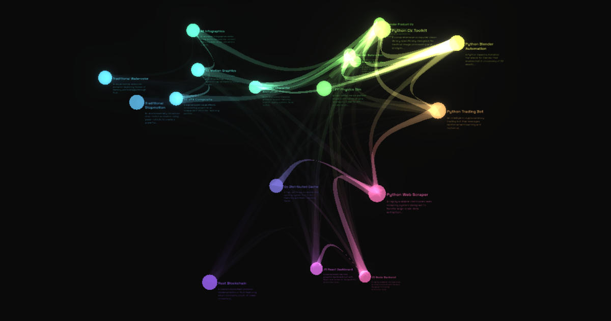

# Latent portfolio

This project allows you to view a list of projects as a 3D representation of their semantic latent space.




## Usage

The easiest way to use this project is to **fork** the repository and modify the article `.md` files in the `latent_portfolio/articles` folder. Each markdown file represents a project that will be visualized in the 3D space.


To publish your portfolio site, you need to configure GitHub Pages to use a custom GitHub Actions workflow:

1. **Enable GitHub Pages**: Go to your repository Settings → Pages
2. **Set source**: Select "GitHub Actions" as the publishing source
3. **Push changes**: The workflow will automatically build and deploy your site when you push to the `master` branch

The site will be available at:
- `https://<your-username>.github.io/` if your repository is named `<your-username>.github.io`
- `https://<your-username>.github.io/<repository-name>/` otherwise

For detailed instructions, see the [GitHub Pages documentation on publishing with a custom GitHub Actions workflow](https://docs.github.com/en/pages/getting-started-with-github-pages/configuring-a-publishing-source-for-your-github-pages-site#publishing-with-a-custom-github-actions-workflow).

## Dev Run

To run the project locally:

1. **Clone and Install dependencies:**
   ```bash
   git clone https://github.com/daylanKifky/latent_portfolio
   cd latent_portfolio
   pip install -e .
   ```

2. **Process articles and generate embeddings:**
   This step reads all markdown files from the `latent_portfolio/articles` folder, generates semantic embeddings, applies dimensionality reduction, and calculates cross-similarities between projects.
   ```bash
   python -m latent_portfolio.build 
   ```

3. **Serve the visualization:**
   Start a local web server to view the 3D visualization in your browser.
   ```bash
   cd public
   python -m http.server 8080
   ```

   Then open `http://localhost:8080` in your browser to see the interactive 3D visualization.

## How it works

### Semantic Space

Each project article is converted into a high-dimensional semantic embedding using a sentence transformer model. This embedding captures the semantic meaning of the project's content (title, description, tags, etc.) as a vector in a semantic space where similar projects are positioned closer together.

### Dimensionality Reduction with PCA

The high-dimensional embeddings (typically 384 or 768 dimensions) are reduced to 3D coordinates using Principal Component Analysis (PCA). PCA finds the principal components that capture the most variance in the data, allowing the semantic relationships to be visualized in 3D space while preserving as much information as possible.

While other dimensionality reduction methods such as UMAP and t-SNE are also available, PCA tends to produce well-defined clusters that work better for visualizing project relationships in this use case.


### Positioning Points in Space

The reduced 3D coordinates are used to position each project as a point in the 3D visualization. Projects with similar semantic content will be positioned closer together in this space, creating natural clusters of related projects.

Colors are also derived from the 3D coordinates, making articles within a cluster use similar colors.

### Cross Similarity for Links

Connecting arcs are drawn between projects based on their cross-similarity scores. The system calculates similarity between all pairs of projects across different fields (title, tags, etc.), and uses these scores to determine which projects should be visually connected. The thickness and opacity of the arcs represent the strength of the semantic relationship between projects.

